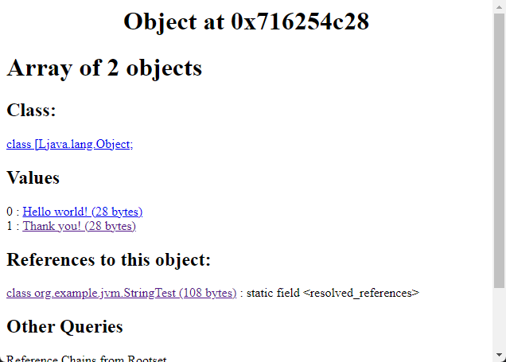

## How many instances of String is created by `new String(literal string)`

### 1. Write test code

```java
package org.example.jvm;

public class StringTest {

    public static void main(String[] args) throws InterruptedException {
        String hello = new String("Hello world!");

        String thank = new String("Thank you!");

        Thread.sleep(30000);
    }

}
```

### 2. Use some jdk tools to analyse heap

```shell
# use jps to get the pid
jps
# use jmap to dump heap
jmap -dump:format=b,file=heapdump.hprof pid
# use jhat to start an HTTP server used for analysing heap
jhat heapdump.hprof
```

### 3. Execute Object Query Language (OQL) query

#### 3.1 Access the query page `http://127.0.0.1:7000/oql/`

#### 3.2 Select all Strings that match a regular expression

- match `Hello world!`

```sql
select s
from java.lang.String s
where /Hello world!/.test(s.value.toString())
```


- match `Thank you!`

```sql
select s
from java.lang.String s
where /Thank you!/.test(s.value.toString())
```


#### 3.3 How to explain this?

We can dig deep into the `Thank you!`.

| object at 0x716255218                                                    | object-at-0x716255200                                                    |
|--------------------------------------------------------------------------|--------------------------------------------------------------------------|
|  |  |

It's obvious that references to object at 0x716255218 is an array, but there are no references to object at 0x716255200.
Let's go into the array.



What surprises did you find? The array has 2 objects, one is `Hello world!` and the other is `Thank you!`. Then which
object refers to the array? The class `org.example.jvm.StringTest` refers to the array through its static
field `<resolved_references>`.
